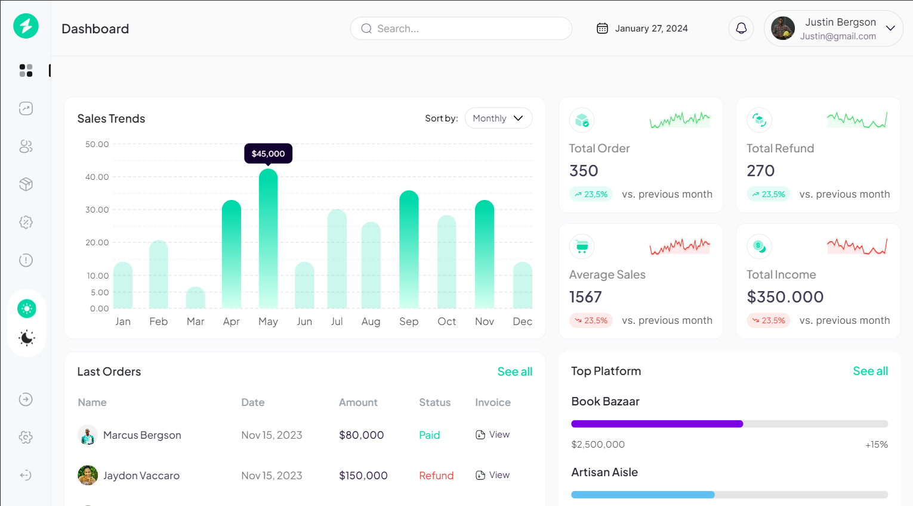

# Geegpay - Front-End Challenge: Unleash Your Creativity

This is a solution to the [Front-End Challenge: Unleash Your Creativity on Geegpay](https://www.geegpay.africa/blog/geegpay-design-and-front-end-challenge-unleash-your-creativity).

## Table of contents

- [Overview](#overview)
  - [The challenge](#the-challenge)
  - [Screenshot](#screenshot)
  - [Links](#links)
- [My process](#my-process)
  - [Built with](#built-with)
- [Author](#author)

## Overview

### The challenge

The task is to craft a responsive and visually appealing analytics dashboard, as seen on [Unleash Your Creativity on Geegpay](https://www.geegpay.africa/blog/geegpay-design-and-front-end-challenge-unleash-your-creativity) and to emphasize a sleek and user-friendly design to guarantee a smooth experience across different devices.

### Screenshot

### Links

- Live Site URL: [Geegpay Dashboard](https://your-live-site-url.com)

## My process

### Built with

- Semantic HTML5 markup
- TailwindCSS
- ReactJS
- React-sparklines
- Desktop-first workflow

## Author

- Twitter - [@adigwebright](https://www.twitter.com/adigwebright)
